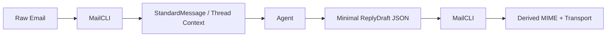
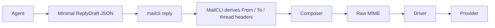

[中文文档](README.zh-CN.md) | English

# MailCLI

**AI-Native Email Interface: turning messy MIME into clean, structured context for agents.**

MailCLI is an open-source email interface built for **AI agents**, **LLM workflows**, and **automation developers**.

It is not trying to be a traditional mail client for humans browsing inboxes.

It is trying to be the stable boundary between agents and email systems:

- agents consume structured message context instead of raw MIME
- agents produce `DraftMessage` or `ReplyDraft` instead of hand-written MIME
- mailbox and transport details stay behind drivers and CLI contracts

Instead of pushing raw MIME, bloated HTML, and provider-specific quirks into prompts, MailCLI turns email into structured JSON, clean Markdown, and machine-facing workflows.

## Zero-Network First Run

If you only want to understand the agent boundary, start here:

```bash
# 1. build mailcli
go build -o mailcli ./cmd/mailcli

# 2. inspect one local message as structured JSON
./mailcli parse --format json testdata/emails/invoice.eml

# 3. run the local thread loop
./mailcli sync --config examples/config/fixtures-dir.yaml --account fixtures --index /tmp/mailcli-fixtures-index.json --limit 20
./mailcli threads --index /tmp/mailcli-fixtures-index.json invoice

# 4. compile the smallest useful reply boundary
./mailcli reply --config examples/config/fixtures-dir.yaml --account fixtures --dry-run examples/artifacts/outbound-patterns/minimal-reply.reply.json
```

Minimal agent handoff:

```json
{
  "account": "fixtures",
  "body_text": "Thanks, we received the invoice notification and queued it for processing.",
  "reply_to_id": "invoice.eml"
}
```

MailCLI fills in the rest:

- `from.address` from account config
- default reply recipient from the source message
- `In-Reply-To`
- `References`
- default reply subject

## In 10 Seconds

```bash
# 1. build mailcli
go build -o mailcli ./cmd/mailcli

# 2. run the zero-network local thread loop
./mailcli sync --config examples/config/fixtures-dir.yaml --account fixtures --index /tmp/mailcli-fixtures-index.json --limit 20
./mailcli threads --index /tmp/mailcli-fixtures-index.json invoice

# 3. inspect the full agent boundary
python3 examples/python/agent_thread_assistant.py \
  --mailcli-bin ./mailcli \
  --config examples/config/fixtures-dir.yaml \
  --account fixtures \
  --index /tmp/mailcli-fixtures-index.json \
  --sync-limit 20 \
  --query invoice
```



## Start Without IMAP

The fastest way to understand MailCLI is to avoid mailbox setup entirely.

The repository already includes:

- a local fixture corpus under `testdata/emails`
- a zero-network config at `examples/config/fixtures-dir.yaml`
- runnable Python examples
- a full local round-trip demo at [Local Thread Demo](docs/en/examples/local-thread-demo.md)
- fixed outbound JSON and MIME pairs at [Outbound Draft Patterns](docs/en/examples/outbound-draft-patterns.md)

Recommended first commands:

```bash
go build -o mailcli ./cmd/mailcli
./mailcli parse --format json testdata/emails/verification.eml
./mailcli sync --config examples/config/fixtures-dir.yaml --account fixtures --index /tmp/mailcli-fixtures-index.json --limit 20
./mailcli threads --index /tmp/mailcli-fixtures-index.json invoice
```

If you are maintaining the repository itself, the local demo artifacts now have a standard check entrypoint:

```bash
make demo-local-thread-check
```

## Project Status

MailCLI is currently in **pre-v0.1 release candidate** stage.

Working today:

- parse local `.eml` input or stdin into `StandardMessage`
- list messages from configured IMAP accounts
- fetch and parse messages by sequence number, UID, or `Message-ID`
- sync recent messages into a local searchable index
- search a local message index without re-fetching remote mail
- inspect local conversation/thread summaries from indexed messages
- compile outbound drafts and replies
- send through SMTP-backed IMAP-style accounts
- integrate with Python or shell agent workflows through stable JSON contracts

Stable enough to build against for `v0.1 RC`:

- `mailcli parse`
- `mailcli list`
- `mailcli get`
- `mailcli sync`
- `mailcli search`
- `mailcli threads`
- `mailcli thread`
- `mailcli send`
- `mailcli reply`
- `StandardMessage`
- `DraftMessage`
- `ReplyDraft`
- `SendResult`

Still evolving:

- HTML cleanup and URL normalization heuristics
- richer list/search semantics for inbox workflows
- richer outbound HTML rendering and attachment ergonomics
- broader provider coverage and extension guidance

Current built-in driver types:

- `imap` for real mailbox access
- `dir` for local `.eml` directories and zero-network agent workflows
- `stub` for local development, tests, and driver-extension examples

Current parser fixture coverage now includes:

- plaintext mail
- newsletter/promo mail
- subscription/unsubscribe mail
- delivery failure mail
- postfix-style DSN / bounce mail
- verification mail
- multilingual verification mail with full-width digits
- quoted-reply verification mail
- invoice/payment mail
- security reset mail
- security reset mail with corporate safe-link wrappers
- attachment-entry mail
- multipart/related inline-image mail

Heuristic areas to treat as evolving:

- action extraction coverage and classification
- verification-code extraction beyond common OTP layouts
- HTML body selection and cleanup for unusual templates
- token estimates

Detailed next-step planning:

- [Next Development Roadmap](docs/en/project/next-roadmap.md)

## Vision

In the AI era, email should not be treated as a pile of HTML and transport headers.

It should behave like a structured API resource.

MailCLI exists to make email as easy for agents to consume and produce as a JSON document.

## Key Features

- **AI-first parser**
  Convert noisy raw email into normalized JSON and Markdown suitable for agent reasoning.
- **Protocol/content separation**
  Drivers handle transport, parsers handle content, composers handle outbound MIME.
- **Action extraction**
  Extract unsubscribe links, security entry points, verification codes, invoice/payment entry points, attachment entry points, bounce/error context, and thread-related metadata.
  Verification-code extraction is conservative but now handles common multilingual and next-line layouts, and can expose `expires_in_seconds` when the mail states a relative expiry.
- **Developer-friendly CLI**
  Support `json`, `yaml`, and `table` output formats, stdin pipelines, and scriptable commands.
- **Bidirectional workflow**
  Read mail with `list/get/parse`, then produce `DraftMessage` and `ReplyDraft` flows for outbound delivery.
- **Provider-agnostic architecture**
  Designed to support IMAP, SMTP, APIs, and future ecosystem integrations without redefining the core model.

## Why MailCLI Exists

Raw email is a poor interface for agents:

- MIME trees are noisy
- HTML templates are token-expensive
- reply threading is easy to break
- provider APIs differ too much

MailCLI solves that by providing a stable boundary:

- inbound email becomes `StandardMessage`
- machine-usable artifacts such as actions, codes, and bounce context are extracted
- outbound intent becomes `DraftMessage` or `ReplyDraft`
- transport stays behind drivers

## Current Capabilities

### Read path

- `mailcli parse --format json|yaml|table <file|->`
- `mailcli list --config ~/.config/mailcli/config.yaml [--account <name>] [--mailbox <name>] [--limit <n>] [--format json|table]`
- `mailcli get --config ~/.config/mailcli/config.yaml [--account <name>] <id>`
- `mailcli sync --config ~/.config/mailcli/config.yaml [--account <name>] [--mailbox <name>] [--limit <n>] [--index <path>]`
- `mailcli search [--index <path>] [--account <name>] [--mailbox <name>] [--limit <n>] [--full] <query>`
- `mailcli search [--index <path>] [--account <name>] [--mailbox <name>] [--thread <thread_id>] [--limit <n>] [--full] <query>`
- `mailcli threads [query] [--index <path>] [--account <name>] [--mailbox <name>] [--limit <n>]`
- `mailcli thread <thread_id> [--index <path>] [--account <name>] [--mailbox <name>] [--limit <n>]`

### Write path

- `mailcli send --dry-run <draft.json>`
- `mailcli send --config ~/.config/mailcli/config.yaml <draft.json>`
- `mailcli reply --dry-run <reply.json>`
- `mailcli reply --config ~/.config/mailcli/config.yaml <reply.json>`

### Outbound Markdown baseline

- headings
- Markdown links rendered as clickable HTML anchors with readable plain-text fallbacks
- unordered lists as `ul/li`
- ordered lists as `ol/li`
- blockquotes
- simple Markdown tables

### Reply support

- `reply_to_message_id` is supported
- `reply_to_id` is supported
- when `reply_to_id` is used, MailCLI can fetch the original message and derive:
  - `In-Reply-To`
  - `References`
  - default reply subject
  - default reply recipient when `to` is omitted
- for non-dry-run outbound commands, MailCLI can also derive `from.address` from configured `smtp_username` or `username`

## Architecture

MailCLI follows a layered architecture so contributors can work on clear boundaries:

1. **Driver Layer**
   Fetch raw messages and send raw bytes.
2. **Parser Engine**
   Decode MIME, normalize charsets, clean HTML, convert to Markdown, and extract actions.
3. **Composer**
   Compile `DraftMessage` and `ReplyDraft` into standards-compliant outbound MIME.
4. **CLI Core**
   Handle account selection, command routing, output formatting, and workflow orchestration.

Core rule:

**protocol belongs to drivers, content belongs to parsers, composition belongs to composers, orchestration belongs to the CLI core**

## Agent Collaboration Model

MailCLI is not just a parser. It is the bridge between agents and email systems.

### Read loop

```text
Agent -> mailcli list/get/parse -> Driver -> Raw Email -> Parser -> StandardMessage -> Agent
```

### Local retrieval loop

```text
Agent -> mailcli sync -> Local Index -> mailcli search -> Indexed Message Context -> Agent
```

Compact `mailcli search` results now expose `thread_id`, so an agent can narrow subsequent retrieval to a single conversation without reconstructing thread membership itself.

### Local thread loop

```text
Agent -> mailcli sync -> mailcli threads -> choose thread -> mailcli search/get/reply
```

### Reply loop



### New outbound message loop

```text
Agent -> DraftMessage -> mailcli send -> Composer -> Raw MIME -> Driver -> Provider
```

Detailed workflow docs:

- [Agent Workflows](docs/en/agent-workflows.md)
- [Outbound Message Spec](docs/en/spec/outbound-message.md)
- [Outbound Draft Patterns](docs/en/examples/outbound-draft-patterns.md)
- [Local Index Spec](docs/en/spec/local-index.md)

## Build From Source

```bash
go build -o mailcli ./cmd/mailcli
./mailcli --help
```

## Minimal Config Example

```yaml
current_account: work
accounts:
  - name: work
    driver: imap
    host: imap.example.com
    port: 993
    username: you@example.com
    password: ${MAILCLI_IMAP_PASSWORD}
    tls: true
    mailbox: INBOX
    smtp_host: smtp.example.com
    smtp_port: 587
    smtp_username: you@example.com
    smtp_password: ${MAILCLI_SMTP_PASSWORD}
```

### Development Config Example

Use the built-in `stub` driver when you want to validate agent flows, CLI output, or parser integration without connecting a real mailbox:

```yaml
current_account: demo
accounts:
  - name: demo
    driver: stub
    mailbox: INBOX
```

Use the built-in `dir` driver when you want to point MailCLI at a local corpus of `.eml` fixtures or archived messages:

```yaml
current_account: fixtures
accounts:
  - name: fixtures
    driver: dir
    path: ./testdata/emails
    mailbox: INBOX
```

The repository already ships a ready-to-run zero-network config:

```text
examples/config/fixtures-dir.yaml
```

Secret fields currently support environment-variable expansion:

- `password`
- `smtp_password`

Recommended usage:

- use app passwords or provider-issued tokens
- inject them through environment variables
- avoid committing real mailbox secrets into config files

## Quick Start

### Recommended Paths

- Zero-network first path:
  Start with `examples/config/fixtures-dir.yaml`, then see [Local Thread Demo](docs/en/examples/local-thread-demo.md).
- Single-message agent path:
  Start with `mailcli parse` or `mailcli get`, then see [Agent Inbox Example](docs/en/examples/agent-inbox-assistant.md).
- Thread-aware agent path:
  Start with `mailcli sync`, `mailcli threads`, and `mailcli thread`, then see [Agent Thread Example](docs/en/examples/agent-thread-assistant.md).
- Outbound draft path:
  Start with [Outbound Draft Patterns](docs/en/examples/outbound-draft-patterns.md) when you want concrete `ReplyDraft` and `DraftMessage` objects before wiring a real provider.
- Model-backed analysis path:
  Keep MailCLI as the boundary and delegate reasoning to an external subprocess provider, then see [OpenAI External Provider Example](docs/en/examples/openai-external-provider.md) and [Examples Index](docs/en/examples/README.md).

### Parse a local email

```bash
cat test.eml | mailcli parse --format json -
```

### Zero-network local thread loop

```bash
./mailcli sync --config examples/config/fixtures-dir.yaml --account fixtures --index /tmp/mailcli-fixtures-index.json --limit 20
./mailcli threads --index /tmp/mailcli-fixtures-index.json invoice
./mailcli thread --index /tmp/mailcli-fixtures-index.json "<invoice-123@example.com>"
```

If you want the full agent-side JSON and reply boundary, use:

```bash
python3 examples/python/agent_thread_assistant.py \
  --mailcli-bin ./mailcli \
  --config examples/config/fixtures-dir.yaml \
  --account fixtures \
  --index /tmp/mailcli-fixtures-index.json \
  --sync-limit 20 \
  --query invoice
```

If you want fixed JSON and MIME pairs for outbound composition without reading Python code, use:

```bash
./mailcli reply --config examples/config/fixtures-dir.yaml --account fixtures --dry-run examples/artifacts/outbound-patterns/ack-reply.draft.json
./mailcli send --dry-run examples/artifacts/outbound-patterns/release-update.draft.json
```

### List messages from a configured account

```bash
mailcli list --config ~/.config/mailcli/config.yaml --format table
```

### Fetch and parse a message by id

```bash
mailcli get --config ~/.config/mailcli/config.yaml "<message-id>"
```

### Sync recent messages into the local index

```bash
mailcli sync --config ~/.config/mailcli/config.yaml --limit 10
```

By default, `sync` skips messages that are already indexed for the same account and message id. Use `--refresh` when you want to re-fetch and overwrite local records.

Current sync output also exposes `listed_count`, `fetched_count`, `indexed_count`, `skipped_count`, `refreshed_count`, and `index_path` so an agent can reason about cache state without reading the index file.

### Search the local index

```bash
mailcli search invoice
```

Use `--full` when an agent wants the full indexed message payload instead of the compact search summary:

```bash
mailcli search --full invoice
```

Use `--account` and `--mailbox` to filter local results in multi-account setups.

Compact search results now include a deterministic `score` field, and results are ordered by relevance before recency.

### Inspect local threads

```bash
mailcli threads
mailcli threads invoice
```

Thread summaries now include the latest message preview and sender, so agents can often choose the right conversation before loading the full thread.

They also aggregate deterministic triage signals from indexed messages, including thread-level `labels`, `categories`, `action_types`, `has_codes`, `code_count`, `action_count`, and `participant_count`.

You can filter threads directly:

```bash
mailcli threads --has-codes
mailcli threads --category verification
mailcli threads --action verify_sign_in
```

### Search within a selected thread

```bash
mailcli search --thread "<root@example.com>" update
```

### Read a full local thread

```bash
mailcli thread "<root@example.com>"
```

### Dry-run an outbound draft

```bash
mailcli send --dry-run draft.json
```

### Dry-run a reply

```bash
mailcli reply --dry-run reply.json
```

### Run the agent example

```bash
python3 examples/python/agent_inbox_assistant.py \
  --mailcli-bin ./mailcli \
  --email testdata/emails/verification.eml
```

### Run the thread agent example

```bash
python3 examples/python/agent_thread_assistant.py \
  --mailcli-bin ./mailcli \
  --config ~/.config/mailcli/config.yaml \
  --account work \
  --index /tmp/mailcli-index.json \
  --query invoice \
  --from-address support@nono.im \
  --reply-text "Thanks for your email."
```

More runnable entry points:

- [Examples Index](docs/en/examples/README.md)

## Current Priorities

- keep the current machine-facing contracts stable for agent developers
- continue improving parser quality through fixture-driven regression work
- make local search and thread workflows more reliable
- keep contribution paths explicit for drivers, parser work, and contract changes

Detailed planning lives in:

- [Next Development Roadmap](docs/en/project/next-roadmap.md)
- [Internal Development Priority](docs/en/project/internal-priority.md)

## Contributing

MailCLI is still early, but the direction is intentional.

We want contributors in these areas:

1. **Parser quality**
   Better MIME handling, HTML cleanup, charset handling, and Markdown fidelity.
2. **Semantic contracts**
   Better shared specs for agent-facing email workflows.
3. **Drivers**
   More providers, safer transport behavior, and better compatibility layers.
4. **Agent tooling**
   Better examples, prompt patterns, and workflow integrations.

Major changes should be discussed first.

Start here:

- [Contribution Guide](CONTRIBUTING.md)
- [Parser Contributor Guide](docs/en/contributing/parser.md)
- [Adding a Driver](docs/en/contributing/drivers.md)

The project is community-open, but it is still directionally curated to stay focused on:

- AI-native workflows
- clean separation of concerns
- stable machine-facing contracts

## Docs Map

- Start here:
  [Examples Index](docs/en/examples/README.md),
  [Local Thread Demo](docs/en/examples/local-thread-demo.md),
  [Outbound Draft Patterns](docs/en/examples/outbound-draft-patterns.md),
  [Agent Workflows](docs/en/agent-workflows.md)
- Specs:
  [Outbound Message Spec](docs/en/spec/outbound-message.md),
  [Agent Provider Contract](docs/en/spec/agent-provider.md),
  [Driver Extension Spec](docs/en/spec/driver-extension.md),
  [Config Spec](docs/en/spec/config.md),
  [Local Index Spec](docs/en/spec/local-index.md)
- Contribution:
  [Contribution Guide](CONTRIBUTING.md),
  [Parser Contributor Guide](docs/en/contributing/parser.md),
  [Adding a Driver](docs/en/contributing/drivers.md)
- Release and planning:
  [v0.1 RC Release Notes](docs/en/release/v0.1-rc.md),
  [Announcement Kit](docs/en/release/announcement-kit.md),
  [Next Development Roadmap](docs/en/project/next-roadmap.md)

## License

Apache-2.0
