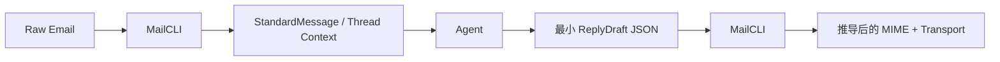

[English Documentation](README.md) | 中文

# MailCLI

**AI Native 的邮件接口：把混乱的 MIME 转换成适合 agent 使用的结构化上下文。**

MailCLI 是一个面向 **AI agent**、**LLM 工作流** 和 **自动化开发者** 的开源邮件接口。

它并不打算成为一个给人类浏览收件箱的传统 mail client。

它的目标是成为 agent 与邮件系统之间的稳定边界：

- agent 消费的是结构化消息上下文，而不是原始 MIME
- agent 产出的是 `DraftMessage` 或 `ReplyDraft`，而不是手写 MIME
- 邮箱接入与传输细节隐藏在 driver 和 CLI 契约后面

它不会把原始 MIME、臃肿 HTML 和 provider 私有行为直接推给 prompt，而是把邮件转换成结构化 JSON、干净 Markdown 和面向机器的工作流。

## 零网络优先上手

如果你只是想先看清楚 agent 边界，优先跑这一组：

```bash
# 1. 先构建 mailcli
go build -o mailcli ./cmd/mailcli

# 2. 先把一封本地邮件解析成结构化 JSON
./mailcli parse --format json testdata/emails/invoice.eml

# 3. 跑本地 thread 闭环
./mailcli sync --config examples/config/fixtures-dir.yaml --account fixtures --index /tmp/mailcli-fixtures-index.json --limit 20
./mailcli threads --index /tmp/mailcli-fixtures-index.json invoice

# 4. 编译最小可用的 reply 边界
./mailcli reply --config examples/config/fixtures-dir.yaml --account fixtures --dry-run examples/artifacts/outbound-patterns/minimal-reply.reply.json
```

最小 agent handoff：

```json
{
  "account": "fixtures",
  "body_text": "Thanks, we received the invoice notification and queued it for processing.",
  "reply_to_id": "invoice.eml"
}
```

剩下的细节交给 MailCLI：

- 从 account config 补 `from.address`
- 从原邮件补默认回复收件人
- 自动补 `In-Reply-To`
- 自动补 `References`
- 自动补默认回复主题

## 10 秒理解

```bash
# 1. 先构建 mailcli
go build -o mailcli ./cmd/mailcli

# 2. 跑零网络的本地 thread 闭环
./mailcli sync --config examples/config/fixtures-dir.yaml --account fixtures --index /tmp/mailcli-fixtures-index.json --limit 20
./mailcli threads --index /tmp/mailcli-fixtures-index.json invoice

# 3. 查看完整的 agent 边界
python3 examples/python/agent_thread_assistant.py \
  --mailcli-bin ./mailcli \
  --config examples/config/fixtures-dir.yaml \
  --account fixtures \
  --index /tmp/mailcli-fixtures-index.json \
  --sync-limit 20 \
  --query invoice
```



## 不配 IMAP 先上手

理解 MailCLI 的最快方式，是先完全绕开真实邮箱配置。

仓库已经自带：

- `testdata/emails` 下的本地 fixture 语料
- 零网络配置 `examples/config/fixtures-dir.yaml`
- 可直接运行的 Python 示例
- 一份完整的本地往返说明：[Local Thread Demo](docs/zh-CN/examples/local-thread-demo.md)
- 一组固定的出站 JSON / MIME 对照样例：[Outbound Draft Patterns](docs/zh-CN/examples/outbound-draft-patterns.md)

推荐先跑这几条命令：

```bash
go build -o mailcli ./cmd/mailcli
./mailcli parse --format json testdata/emails/verification.eml
./mailcli sync --config examples/config/fixtures-dir.yaml --account fixtures --index /tmp/mailcli-fixtures-index.json --limit 20
./mailcli threads --index /tmp/mailcli-fixtures-index.json invoice
```

如果你正在维护仓库本身，现在也有统一的 demo 产物校验入口：

```bash
make demo-local-thread-check
```

## 项目状态

MailCLI 当前处于 **pre-v0.1 release candidate** 阶段。

现在已经可用的部分：

- 将本地 `.eml` 或 stdin 解析为 `StandardMessage`
- 从已配置的 IMAP 账户列出邮件
- 通过序号、UID 或 `Message-ID` 抓取并解析邮件
- 将近期邮件同步到本地可检索索引
- 在不重复远程抓取的前提下检索本地邮件索引
- 查看本地索引中的会话 / thread 摘要
- 编译出站草稿和回复草稿
- 通过 SMTP 为 IMAP 风格账户发信
- 通过稳定 JSON 契约与 Python / shell agent 工作流协作

在 `v0.1 RC` 阶段，已经足够作为稳定集成边界的部分：

- `mailcli parse`
- `mailcli list`
- `mailcli get`
- `mailcli sync`
- `mailcli search`
- `mailcli threads`
- `mailcli thread`
- `mailcli send`
- `mailcli reply`
- `StandardMessage`
- `DraftMessage`
- `ReplyDraft`
- `SendResult`

仍在持续完善的部分：

- HTML 清洗与 URL 归一化策略
- 更适合 inbox workflow 的 list/search 语义
- 出站 HTML 渲染质量和附件体验
- 更广的 provider 覆盖与扩展文档

当前内置的 driver 类型：

- `imap`，用于真实邮箱接入
- `dir`，用于本地 `.eml` 目录和零网络 agent 工作流
- `stub`，用于本地开发、测试和 driver 扩展示例

当前 parser 样本集已经覆盖：

- 纯文本邮件
- newsletter / 推广邮件
- 订阅 / 退订邮件
- 投递失败邮件
- Postfix 风格 DSN / 退信邮件
- 验证码邮件
- 带全角数字的多语言验证码邮件
- 引用旧验证码的回复链邮件
- 账单 / 支付邮件
- 安全重置邮件
- 带企业 safe-link 包装链接的安全重置邮件
- 附件入口邮件
- `multipart/related` 内联图片邮件

应视为持续演进中的 heuristic 区域：

- action 提取覆盖率和分类细节
- 常见 OTP 之外的验证码提取
- 异常 HTML 模板下的正文选择与清洗
- token 估算

下一阶段详细规划：

- [下一阶段开发路线](docs/zh-CN/project/next-roadmap.md)

## 核心愿景

在 AI 时代，邮件不应该再只是 HTML 模板和传输头的堆叠。

它应该像 API 资源一样被结构化消费。

MailCLI 的存在，就是为了让 agent 处理邮件像读取一份 JSON 文档一样自然。

## 核心特性

- **AI-First Parser**
  将嘈杂的原始邮件转换为适合 agent 推理的标准化 JSON 与 Markdown。
- **协议与内容解耦**
  Driver 负责传输，Parser 负责内容，Composer 负责出站 MIME。
- **动作提取**
  自动提取退订链接、安全入口、验证码、账单/付款入口、附件入口、退信/错误上下文和线程相关元数据。
  验证码提取保持保守策略，但已经支持常见的多语言关键词、“下一非空行”排版，以及相对有效期的 `expires_in_seconds`。
- **开发者友好的 CLI**
  支持 `json`、`yaml`、`table` 输出格式，支持 stdin 管道。
- **双向工作流**
  通过 `list/get/parse` 读邮件，通过 `DraftMessage` 和 `ReplyDraft` 驱动发信与回复。
- **Provider 无关架构**
  核心模型不绑定单一后端，后续可支持 IMAP、SMTP、API 以及其他生态集成。

## 为什么需要 MailCLI

原始邮件不是一个适合 agent 的接口：

- MIME 树太嘈杂
- HTML 模板太耗 token
- 回复线程很容易断
- 各家 provider 的 API 差异太大

MailCLI 提供的是一个稳定边界：

- 入站邮件统一变成 `StandardMessage`
- 同时提取 actions、codes、退信上下文等机器可直接消费的结果
- 出站意图统一变成 `DraftMessage` 或 `ReplyDraft`
- 传输细节隐藏在 driver 后面

## 当前能力

### 读路径

- `mailcli parse --format json|yaml|table <file|->`
- `mailcli list --config ~/.config/mailcli/config.yaml [--account <name>] [--mailbox <name>] [--limit <n>] [--format json|table]`
- `mailcli get --config ~/.config/mailcli/config.yaml [--account <name>] <id>`
- `mailcli sync --config ~/.config/mailcli/config.yaml [--account <name>] [--mailbox <name>] [--limit <n>] [--index <path>]`
- `mailcli search [--index <path>] [--account <name>] [--mailbox <name>] [--limit <n>] [--full] <query>`
- `mailcli search [--index <path>] [--account <name>] [--mailbox <name>] [--thread <thread_id>] [--limit <n>] [--full] <query>`
- `mailcli threads [query] [--index <path>] [--account <name>] [--mailbox <name>] [--limit <n>]`
- `mailcli thread <thread_id> [--index <path>] [--account <name>] [--mailbox <name>] [--limit <n>]`

### 写路径

- `mailcli send --dry-run <draft.json>`
- `mailcli send --config ~/.config/mailcli/config.yaml <draft.json>`
- `mailcli reply --dry-run <reply.json>`
- `mailcli reply --config ~/.config/mailcli/config.yaml <reply.json>`

### 出站 Markdown 基线

- 标题
- Markdown 链接会渲染成可点击的 HTML anchor，同时保留可读的纯文本回退
- 无序列表会输出为 `ul/li`
- 有序列表会输出为 `ol/li`
- 引用块
- 简单 Markdown 表格

### 回复能力

- 支持 `reply_to_message_id`
- 支持 `reply_to_id`
- 当使用 `reply_to_id` 时，MailCLI 可以先抓取原邮件，再自动推导：
  - `In-Reply-To`
  - `References`
  - 默认回复主题
  - 当 `to` 省略时，默认回复收件人
- 对非 dry-run 的发送命令，MailCLI 也可以从配置的 `smtp_username` 或 `username` 补 `from.address`

## 架构设计

MailCLI 采用分层架构，方便贡献者在明确边界内工作：

1. **Driver Layer**
   获取原始邮件、发送原始字节。
2. **Parser Engine**
   负责 MIME 解码、字符集归一化、HTML 清洗、Markdown 转换和动作提取。
3. **Composer**
   负责把 `DraftMessage` 和 `ReplyDraft` 编译成标准出站 MIME。
4. **CLI Core**
   负责账户选择、命令编排、输出格式化和流程调度。

核心原则：

**协议归 driver，内容归 parser，编译归 composer，流程调度归 CLI core**

## Agent 协作模型

MailCLI 不只是一个 parser，它是 agent 和邮件系统之间的桥梁。

### 读循环

```text
Agent -> mailcli list/get/parse -> Driver -> Raw Email -> Parser -> StandardMessage -> Agent
```

### 本地检索循环

```text
Agent -> mailcli sync -> Local Index -> mailcli search -> Indexed Message Context -> Agent
```

当前紧凑版 `mailcli search` 结果会直接暴露 `thread_id`，agent 不需要自己重建线程归属，就可以把后续检索收敛到单个会话。

### 本地线程循环

```text
Agent -> mailcli sync -> mailcli threads -> 选择 thread -> mailcli search/get/reply
```

### 回复循环


### 新邮件发送循环

```text
Agent -> DraftMessage -> mailcli send -> Composer -> Raw MIME -> Driver -> Provider
```

详细说明见：

- [Agent 协作流程](docs/zh-CN/agent-workflows.md)
- [发送侧消息规范](docs/zh-CN/spec/outbound-message.md)
- [本地索引规范](docs/zh-CN/spec/local-index.md)

## 从源码构建

```bash
go build -o mailcli ./cmd/mailcli
./mailcli --help
```

## 最小配置示例

```yaml
current_account: work
accounts:
  - name: work
    driver: imap
    host: imap.example.com
    port: 993
    username: you@example.com
    password: ${MAILCLI_IMAP_PASSWORD}
    tls: true
    mailbox: INBOX
    smtp_host: smtp.example.com
    smtp_port: 587
    smtp_username: you@example.com
    smtp_password: ${MAILCLI_SMTP_PASSWORD}
```

### 开发用配置示例

如果你想在不接入真实邮箱的前提下验证 agent 流程、CLI 输出或 parser 集成，可以直接使用内置的 `stub` driver：

```yaml
current_account: demo
accounts:
  - name: demo
    driver: stub
    mailbox: INBOX
```

如果你想让 MailCLI 直接读取本地一批 `.eml` fixture 或归档邮件，可以使用内置的 `dir` driver：

```yaml
current_account: fixtures
accounts:
  - name: fixtures
    driver: dir
    path: ./testdata/emails
    mailbox: INBOX
```

仓库里已经直接附带一份可运行的零网络配置：

```text
examples/config/fixtures-dir.yaml
```

当前支持环境变量展开的秘密字段：

- `password`
- `smtp_password`

推荐方式：

- 使用 app password 或 provider 提供的 token
- 通过环境变量注入
- 不要把真实邮箱密码直接提交进配置文件

## 快速开始

### 推荐路径

- 零网络优先路径：
  从 `examples/config/fixtures-dir.yaml` 开始，再看 [Local Thread Demo](docs/zh-CN/examples/local-thread-demo.md)。
- 单封邮件 agent 路径：
  从 `mailcli parse` 或 `mailcli get` 开始，再看 [Agent Inbox 示例](docs/zh-CN/examples/agent-inbox-assistant.md)。
- thread 感知 agent 路径：
  从 `mailcli sync`、`mailcli threads` 和 `mailcli thread` 开始，再看 [Agent Thread 示例](docs/zh-CN/examples/agent-thread-assistant.md)。
- 出站草稿路径：
  如果你想先看固定的 `ReplyDraft` 和 `DraftMessage` 对象，再接 provider，直接看 [Outbound Draft Patterns](docs/zh-CN/examples/outbound-draft-patterns.md)。
- 模型驱动分析路径：
  保持 MailCLI 作为稳定边界，把推理委托给外部子进程 provider，再看 [OpenAI External Provider 示例](docs/zh-CN/examples/openai-external-provider.md) 和 [Examples 索引](docs/zh-CN/examples/README.md)。

### 解析本地邮件

```bash
cat test.eml | mailcli parse --format json -
```

### 零网络本地 thread 闭环

```bash
./mailcli sync --config examples/config/fixtures-dir.yaml --account fixtures --index /tmp/mailcli-fixtures-index.json --limit 20
./mailcli threads --index /tmp/mailcli-fixtures-index.json invoice
./mailcli thread --index /tmp/mailcli-fixtures-index.json "<invoice-123@example.com>"
```

如果你想直接看 agent 侧完整 JSON 和 reply 边界，可以运行：

```bash
python3 examples/python/agent_thread_assistant.py \
  --mailcli-bin ./mailcli \
  --config examples/config/fixtures-dir.yaml \
  --account fixtures \
  --index /tmp/mailcli-fixtures-index.json \
  --sync-limit 20 \
  --query invoice
```

如果你想在不读 Python 示例的情况下直接查看固定的出站 JSON / MIME 对照，可以运行：

```bash
./mailcli reply --config examples/config/fixtures-dir.yaml --account fixtures --dry-run examples/artifacts/outbound-patterns/ack-reply.draft.json
./mailcli send --dry-run examples/artifacts/outbound-patterns/release-update.draft.json
```

### 从已配置账户列出邮件

```bash
mailcli list --config ~/.config/mailcli/config.yaml --format table
```

### 按 id 抓取并解析邮件

```bash
mailcli get --config ~/.config/mailcli/config.yaml "<message-id>"
```

### 把近期邮件同步到本地索引

```bash
mailcli sync --config ~/.config/mailcli/config.yaml --limit 10
```

`sync` 默认会跳过同一 account 下已经索引过的消息。如果你希望重新抓取并覆盖本地记录，可以显式加上 `--refresh`。

当前 `sync` 输出也会显式返回 `listed_count`、`fetched_count`、`indexed_count`、`skipped_count`、`refreshed_count` 和 `index_path`，这样 agent 不用直接读取索引文件，也能理解本地缓存状态。

### 检索本地索引

```bash
mailcli search invoice
```

如果 agent 需要直接拿到本地索引里的完整消息，而不是紧凑摘要，可以使用 `--full`：

```bash
mailcli search --full invoice
```

在多账户场景下，可以使用 `--account` 和 `--mailbox` 对本地结果做过滤。

当前紧凑搜索结果还会返回一个确定性的 `score` 字段，并优先按相关性、再按时间排序。

### 查看本地线程

```bash
mailcli threads
mailcli threads invoice
```

当前线程摘要已经包含最新消息的预览和发件人，所以 agent 往往可以先在 `threads` 阶段完成初筛，再决定是否读取完整线程。

线程摘要现在也会聚合确定性的 triage 信号，包括 thread 级别的 `labels`、`categories`、`action_types`、`has_codes`、`code_count`、`action_count` 和 `participant_count`。

现在也可以直接在 thread 层过滤：

```bash
mailcli threads --has-codes
mailcli threads --category verification
mailcli threads --action verify_sign_in
```

### 在选中的线程内继续搜索

```bash
mailcli search --thread "<root@example.com>" update
```

### 读取本地完整线程

```bash
mailcli thread "<root@example.com>"
```

### Dry-run 新邮件

```bash
mailcli send --dry-run draft.json
```

### Dry-run 回复

```bash
mailcli reply --dry-run reply.json
```

### 运行 agent 示例

```bash
python3 examples/python/agent_inbox_assistant.py \
  --mailcli-bin ./mailcli \
  --email testdata/emails/verification.eml
```

### 运行 thread agent 示例

```bash
python3 examples/python/agent_thread_assistant.py \
  --mailcli-bin ./mailcli \
  --config ~/.config/mailcli/config.yaml \
  --account work \
  --index /tmp/mailcli-index.json \
  --query invoice \
  --from-address support@nono.im \
  --reply-text "Thanks for your email."
```

更多可运行入口：

- [Examples 索引](docs/zh-CN/examples/README.md)

## 当前优先级

- 保持当前 agent-facing 机器接口稳定
- 继续用 fixture 驱动的方式提升 parser 质量
- 提升本地 search 和 thread 工作流的可靠性
- 让 driver、parser 和契约变更的贡献路径更明确

详细规划见：

- [下一阶段开发路线](docs/zh-CN/project/next-roadmap.md)
- [内部主导开发顺序](docs/zh-CN/project/internal-priority.md)

## 如何贡献

MailCLI 还处在早期阶段，但方向已经明确。

我们重点欢迎这些贡献：

1. **Parser 质量**
   更好的 MIME 处理、HTML 清洗、字符集处理和 Markdown 质量。
2. **语义契约**
   更清晰的 agent-facing 邮件标准。
3. **Driver**
   更多 provider、更稳的传输行为、更好的兼容层。
4. **Agent 工具链**
   更好的 examples、prompt 模式和工作流集成。

重大改动建议先讨论。

建议先看：

- [贡献指南](CONTRIBUTING.zh-CN.md)
- [Parser 贡献指南](docs/zh-CN/contributing/parser.md)
- [如何添加 Driver](docs/zh-CN/contributing/drivers.md)

项目对社区开放，但方向上会持续围绕以下目标收敛：

- AI-native workflows
- 清晰的关注点分离
- 稳定的机器接口

## 文档导航

- 从这里开始：
  [Examples 索引](docs/zh-CN/examples/README.md)，
  [Local Thread Demo](docs/zh-CN/examples/local-thread-demo.md)，
  [Outbound Draft Patterns](docs/zh-CN/examples/outbound-draft-patterns.md)，
  [Agent 协作流程](docs/zh-CN/agent-workflows.md)
- 规范：
  [发送侧消息规范](docs/zh-CN/spec/outbound-message.md)，
  [Agent Provider 契约](docs/zh-CN/spec/agent-provider.md)，
  [Driver 扩展规范](docs/zh-CN/spec/driver-extension.md)，
  [配置规范](docs/zh-CN/spec/config.md)，
  [本地索引规范](docs/zh-CN/spec/local-index.md)
- 贡献：
  [贡献指南](CONTRIBUTING.zh-CN.md)，
  [Parser 贡献指南](docs/zh-CN/contributing/parser.md)，
  [如何添加 Driver](docs/zh-CN/contributing/drivers.md)
- 发布与规划：
  [v0.1 RC 发布说明](docs/zh-CN/release/v0.1-rc.md)，
  [Announcement Kit](docs/zh-CN/release/announcement-kit.md)，
  [下一阶段开发路线](docs/zh-CN/project/next-roadmap.md)

## 许可证

Apache-2.0
