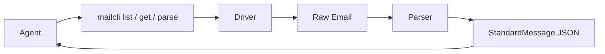
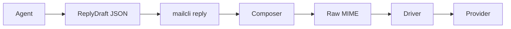
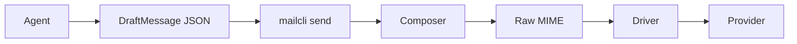

[中文](../zh-CN/agent-workflows.md) | English

# Agent Workflows

This document explains how `MailCLI` and AI agents are expected to work together.

The short version is:

- agents should reason over structured email data, not raw MIME
- agents should produce intent-level drafts, not hand-written MIME
- `mailcli` should be the bridge between agent logic and email protocols

## Responsibility Split

| Layer | Responsibility |
| --- | --- |
| Agent | decide what to read, classify, summarize, reply, or send |
| MailCLI Cmd | expose stable commands and JSON/YAML/table contracts |
| Driver | fetch raw messages and send raw bytes |
| Parser | convert raw email into `StandardMessage` |
| Composer | convert `DraftMessage` and `ReplyDraft` into raw MIME |

## Why This Split Exists

If agents read raw MIME directly:

- token usage is much worse
- quoted-printable, HTML, and multipart noise leak into prompts
- thread and action extraction become inconsistent

If agents write raw MIME directly:

- headers are easy to get wrong
- reply threading breaks easily
- attachments and multipart boundaries become fragile
- protocol details leak into application logic

`MailCLI` exists to keep those concerns out of the agent prompt loop.

## The Read Path

Use this path when an agent needs to inspect inbox state or understand a message.



### Typical read loop

1. Agent calls `mailcli list`
2. Agent chooses a message id
3. Agent calls `mailcli get <id>`
4. `MailCLI` fetches raw email through the configured driver
5. `MailCLI` parses it into `StandardMessage`
6. Agent reasons over structured output

Typical agent-usable fields from this step include:

- clean Markdown body
- normalized headers and thread metadata
- extracted `codes` for verification-code style emails, including common multilingual and next-line layouts
- extracted actions such as `unsubscribe`, `view_online`, `confirm_subscription`, `report_abuse`, `view_attachment`, `download_attachment`, `view_invoice`, `pay_invoice`, `reset_password`, and `verify_sign_in`

### Example

```bash
mailcli list --config ~/.config/mailcli/config.yaml
mailcli get --config ~/.config/mailcli/config.yaml "<message-id>"
```

## The Reply Path

Use this path when the agent is responding to an existing email thread.



### Important rule

The agent should produce a `ReplyDraft`, not a raw email message.

`MailCLI` should handle:

- `In-Reply-To`
- `References`
- `Message-ID`
- `Date`
- MIME assembly
- provider handoff

### Reply with direct message id

```json
{
  "account": "work",
  "from": { "address": "support@nono.im" },
  "to": [{ "address": "user@example.com" }],
  "subject": "Re: Question",
  "body_text": "Thanks for your email.",
  "reply_to_message_id": "<orig-123@example.com>",
  "references": ["<older-1@example.com>", "<orig-123@example.com>"]
}
```

### Reply with internal id

```json
{
  "account": "work",
  "from": { "address": "support@nono.im" },
  "to": [{ "address": "user@example.com" }],
  "body_text": "Thanks for your email.",
  "reply_to_id": "imap:uid:12345"
}
```

When `reply_to_id` is used, `mailcli` may fetch the original message and derive:

- original `Message-ID`
- `References`
- default reply subject

### Example

```bash
mailcli reply --config ~/.config/mailcli/config.yaml reply.json
mailcli reply --dry-run reply.json
```

## The New Message Path

Use this path when the agent is sending a brand new outbound email.



### Example

```json
{
  "account": "work",
  "from": { "address": "support@nono.im" },
  "to": [{ "address": "user@example.com" }],
  "subject": "Welcome",
  "body_text": "Hello from MailCLI."
}
```

```bash
mailcli send --config ~/.config/mailcli/config.yaml draft.json
mailcli send --dry-run draft.json
```

## Round-Trip Patterns

### Inbox triage

```text
mailcli list -> choose id -> mailcli get -> classify -> archive/reply/escalate
```

### Support reply

```text
mailcli get -> agent writes ReplyDraft -> mailcli reply
```

### Agent-triggered outbound notification

```text
agent writes DraftMessage -> mailcli send
```

## What Developers Should Build Where

Build in the agent layer:

- classification
- prioritization
- summarization
- reply drafting
- business rules

Build in `MailCLI`:

- parsing
- MIME generation
- account resolution
- protocol adapters
- thread header management
- output contracts

Do not put provider-specific business rules into the core parser or composer unless they are truly general.

## Stable Contracts For Integrators

For agent developers, the stable contracts should be:

- `mailcli list`
- `mailcli get`
- `mailcli parse`
- `mailcli send`
- `mailcli reply`
- `StandardMessage`
- `DraftMessage`
- `ReplyDraft`
- `SendResult`

These are the boundaries that should remain easy to call from Python, shell, Node.js, or other agent runtimes.
