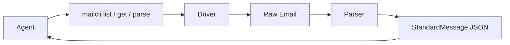
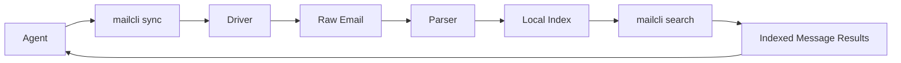
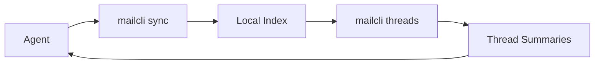
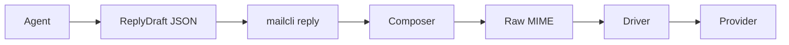
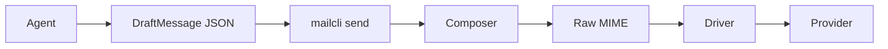

[English](../en/agent-workflows.md) | 中文

# Agent 协作流程

这份文档解释 `MailCLI` 和 AI agent 应该如何协作。

简短结论是：

- agent 应该处理结构化邮件数据，而不是原始 MIME
- agent 应该生成意图级草稿，而不是手写 MIME
- `mailcli` 应该作为 agent 逻辑与邮件协议之间的桥梁

## 职责边界

| 层 | 职责 |
| --- | --- |
| Agent | 决定读什么、如何分类、如何总结、是否回复、是否发送 |
| MailCLI Cmd | 提供稳定命令与 JSON/YAML/table 契约 |
| Driver | 获取原始邮件、发送原始字节 |
| Parser | 把原始邮件转换成 `StandardMessage` |
| Composer | 把 `DraftMessage` 和 `ReplyDraft` 编译成原始 MIME |

## 为什么要这样拆

如果让 agent 直接读 raw MIME：

- token 消耗更高
- quoted-printable、HTML、multipart 噪音会直接泄漏到 prompt
- 线程信息和动作提取会变得不稳定

如果让 agent 直接写 raw MIME：

- 很容易把 header 写错
- 回复线程很容易断
- 附件和 multipart 边界很脆弱
- 协议细节会泄漏进业务逻辑

`MailCLI` 的存在，就是把这些问题从 agent 的 prompt 循环里拿走。

## 读路径

当 agent 需要查看收件箱状态或理解某封邮件时，走这条链路。



### 典型读循环

1. agent 调用 `mailcli list`
2. agent 选择一个 message id
3. agent 调用 `mailcli get <id>`
4. `MailCLI` 通过已配置 driver 抓取原始邮件
5. `MailCLI` 把它解析为 `StandardMessage`
6. agent 基于结构化结果进行推理

这个阶段常见的 agent 可用字段包括：

- 干净的 Markdown 正文
- 归一化后的 header 与线程元数据
- 提取出来的 `codes`，用于验证码类邮件，支持常见多语言关键词、“下一非空行”排版，以及可选的 `expires_in_seconds`
- 已提取的动作，例如 `unsubscribe`、`view_online`、`confirm_subscription`、`report_abuse`、`view_attachment`、`download_attachment`、`view_invoice`、`pay_invoice`、`reset_password`、`verify_sign_in`

### 示例

```bash
mailcli list --config ~/.config/mailcli/config.yaml
mailcli get --config ~/.config/mailcli/config.yaml "<message-id>"
```

参考示例：

- [Agent Inbox Assistant](examples/agent-inbox-assistant.md)

## 本地检索路径

当 agent 希望围绕“最近同步过的邮件”进行快速本地检索时，走这条链路。



### 典型本地检索循环

1. agent 调用 `mailcli sync`
2. `MailCLI` 从当前账户列出近期邮件
3. `MailCLI` 抓取并解析这些邮件
4. `MailCLI` 把归一化结果写入本地索引
5. agent 调用 `mailcli search <query>`
6. agent 决定是否继续 `get` 全量邮件、直接回复，或继续分拣

### 示例

```bash
mailcli sync --config ~/.config/mailcli/config.yaml --limit 20
mailcli search invoice
```

`mailcli sync` 现在默认按增量方式工作：

- 已存在的本地索引记录会被跳过
- 使用 `--refresh` 可以强制重新抓取并覆盖

如果 agent 希望直接基于本地索引中的完整消息内容进行推理，而不重新访问远端邮箱，可以使用：

```bash
mailcli search --full invoice
```

在多账户本地检索场景下，可以结合 `--account` 和 `--mailbox` 使用。

当前紧凑本地搜索结果也会暴露一个相关性 `score`，方便 agent 在不额外做排序逻辑的情况下决定下一步处理哪封邮件。

## 本地线程路径

当 agent 更关心“会话”而不是“单封邮件”时，可以走这条链路。



### 典型本地线程循环

1. agent 调用 `mailcli sync`
2. agent 调用 `mailcli threads`
3. MailCLI 基于 `references`、`in_reply_to` 和 `message_id` 聚合本地消息
4. agent 选择一个 thread
5. 紧凑版 `mailcli search` 结果已经会暴露 `thread_id`，所以 agent 可以继续调用 `mailcli search --thread <thread_id> <query>`
6. agent 也可以直接调用 `mailcli thread <thread_id>` 读取本地完整线程
7. agent 决定是否抓取远端完整消息或直接草拟回复

当前线程摘要还会暴露最新消息的预览和发件人，这能减少 agent 在分拣阶段读取完整线程的次数。

它们也会暴露确定性的 thread 级 triage 元数据，比如聚合后的 `labels`、`categories`、`action_types` 和 `has_codes`。

agent 现在也可以直接在本地 thread 层做过滤：

- `mailcli threads --has-codes`
- `mailcli threads --category verification`
- `mailcli threads --action verify_sign_in`

参考示例：

- [Agent Thread Assistant](examples/agent-thread-assistant.md)
- [Local Thread Demo](examples/local-thread-demo.md)

## 回复路径

当 agent 需要回复已有邮件线程时，走这条链路。



### 核心原则

agent 应该生成 `ReplyDraft`，而不是原始邮件。

`MailCLI` 负责处理：

- `In-Reply-To`
- `References`
- `Message-ID`
- `Date`
- MIME 组装
- provider 发送交接

### 直接通过 message id 回复

```json
{
  "account": "work",
  "from": { "address": "support@nono.im" },
  "to": [{ "address": "user@example.com" }],
  "subject": "Re: Question",
  "body_text": "Thanks for your email.",
  "reply_to_message_id": "<orig-123@example.com>",
  "references": ["<older-1@example.com>", "<orig-123@example.com>"]
}
```

### 通过内部 id 回复

```json
{
  "account": "work",
  "from": { "address": "support@nono.im" },
  "to": [{ "address": "user@example.com" }],
  "body_text": "Thanks for your email.",
  "reply_to_id": "imap:uid:12345"
}
```

当使用 `reply_to_id` 时，`mailcli` 可以先抓取原邮件，并自动推导：

- 原始 `Message-ID`
- `References`
- 默认回复主题

### 示例

```bash
mailcli reply --config ~/.config/mailcli/config.yaml reply.json
mailcli reply --dry-run reply.json
```

## 新邮件发送路径

当 agent 需要发送全新的邮件时，走这条链路。



### 示例

```json
{
  "account": "work",
  "from": { "address": "support@nono.im" },
  "to": [{ "address": "user@example.com" }],
  "subject": "Welcome",
  "body_text": "Hello from MailCLI."
}
```

```bash
mailcli send --config ~/.config/mailcli/config.yaml draft.json
mailcli send --dry-run draft.json
```

## 往返模式

### 收件箱分拣

```text
mailcli list -> 选中 id -> mailcli get -> 分类 -> 归档 / 回复 / 升级
```

### 本地检索

```text
mailcli sync -> mailcli search -> 选中 id -> mailcli get/reply
```

### 客服回复

```text
mailcli get -> agent 生成 ReplyDraft -> mailcli reply
```

### agent 主动通知

```text
agent 生成 DraftMessage -> mailcli send
```

## 开发者应该把逻辑写在哪

应该放在 agent 层的：

- 分类
- 优先级判断
- 摘要
- 回复草拟
- 业务规则

应该放在 `MailCLI` 的：

- 解析
- MIME 生成
- 账户解析
- 协议适配
- 线程头管理
- 输出契约

除非确实是通用能力，否则不要把 provider 私有业务规则塞进 parser 或 composer。

## 对集成方稳定的边界

对 agent 开发者来说，最稳定的边界应该是：

- `mailcli list`
- `mailcli get`
- `mailcli parse`
- `mailcli sync`
- `mailcli search`
- `mailcli send`
- `mailcli reply`
- `StandardMessage`
- `DraftMessage`
- `ReplyDraft`
- `SendResult`

这些边界应该始终保持容易被 Python、shell、Node.js 和其他 agent runtime 调用。
